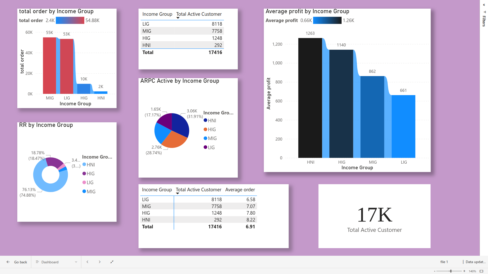

# 🚗 Car Sales Data Analysis | Power BI

I built this project to practice and showcase my data analytics skills 
using a real-world style automobile sales dataset. The goal was to go 
beyond just learning theory — I wanted to actually build something that 
answers business questions through clean data and good visuals.

---

## What This Project Is About

This is an end-to-end data analytics project on automobile sales data. 
I worked with multiple datasets covering sales transactions, customer 
profiles, vehicle details, and dealership performance — then cleaned, 
modelled, and visualized everything in Power BI.

---

## Tools I Used

- **Power BI** — for data modelling, DAX measures, and dashboard design
- **Excel / CSV** — raw data source
- **Power Query** — data cleaning and transformation
- **DAX** — for building KPIs and calculated measures

---

## What I Explored

- Which car models and brands sold the most
- How sales varied across regions and dealerships
- Monthly and quarterly sales trends over time
- Customer loyalty patterns and high-value segments
- After-sales service performance and satisfaction scores

---
## Dashboard Preview

## Project Files

| File | What It Is |
|------|------------|
| `Car_sales.csv` | Main automobile sales dataset |
| `Automobile_data.csv` | Supporting vehicle data |
| `FINAL_project.pbix` | Power BI dashboard (main file) |
| `BI_Project_Report.docx` | Project documentation |
| `POWER_BI_REPORT_Maanvi.docx` | Detailed report write-up |

---

## Key Takeaways

Working on this taught me how much difference a clean data model makes 
before you even start building visuals. Writing DAX measures, setting up 
proper relationships between tables, and designing a dashboard that 
actually answers real questions was a great hands-on experience.

---

## About Me

I'm Maanvi Tyagi, currently learning data analytics with a focus on 
Power BI, Excel, and SQL. This is one of my first end-to-end projects 
and I'm actively building more.

📧 Feel free to connect with me on LinkedIn!

 
